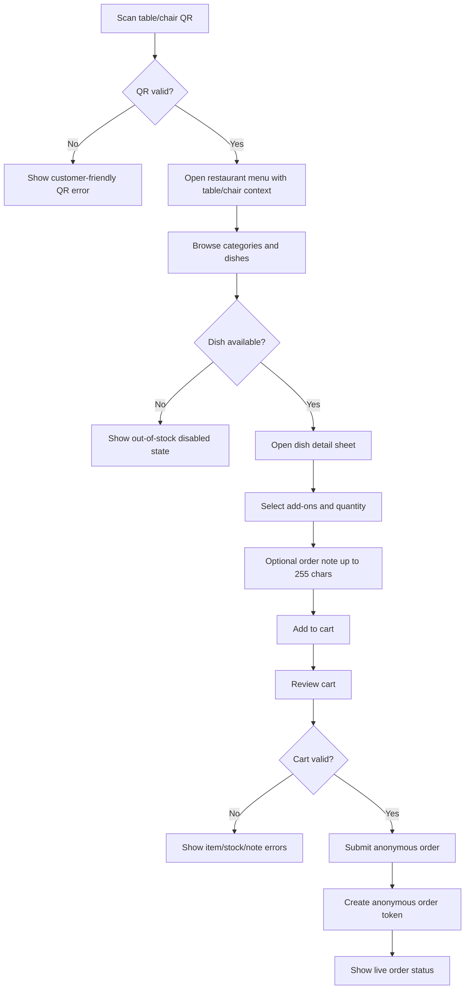
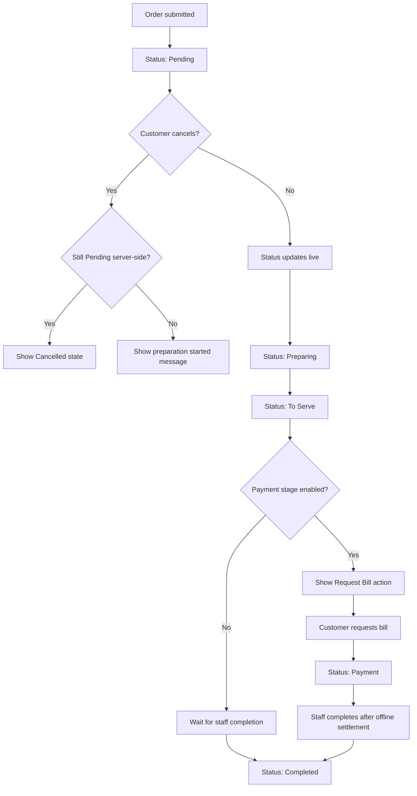
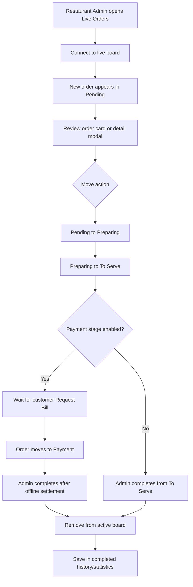
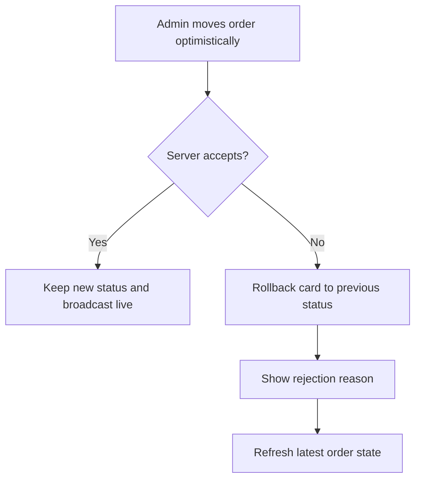
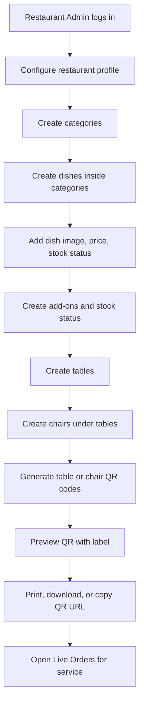
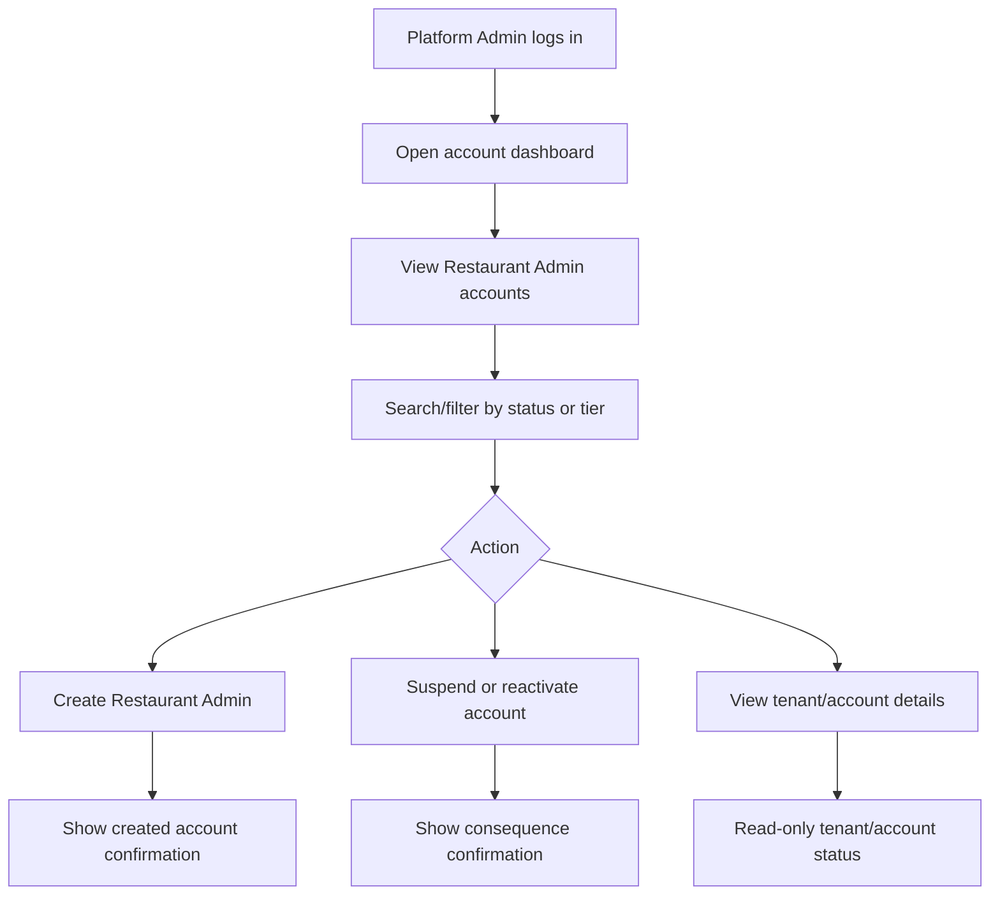
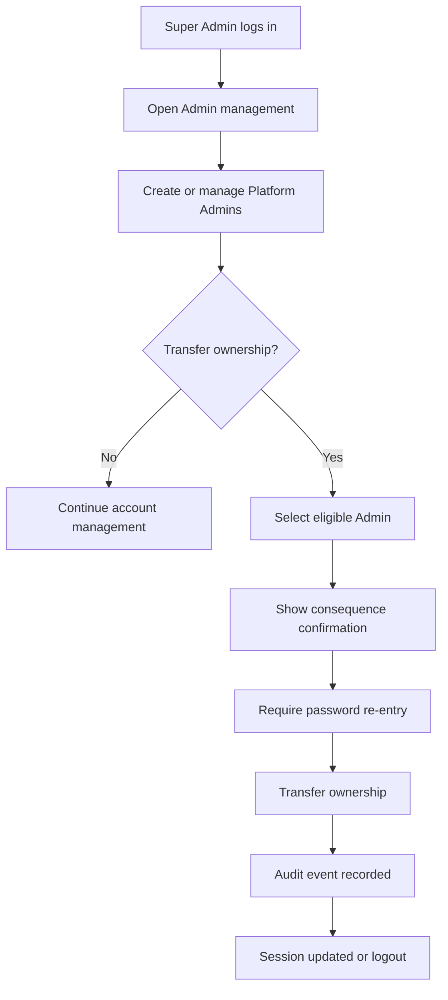

# UX Design Specification qr-resto-hub

**Author:** Mr. JRW
**Date:** 2026-05-06

---

<!-- UX design content will be appended sequentially through collaborative workflow steps -->

## Executive Summary

### Project Vision

QR Resto Hub is a multi-tenant B2B SaaS web app that helps restaurants run dine-in QR ordering without forcing customers to install an app or create an account. The customer experience must feel instant, lightweight, and phone-native in the browser. The Restaurant Admin experience must feel operational, focused, and fast enough for live service.

The product UX should prioritize the full dine-in loop: scan QR, browse menu, place anonymous order, watch live status, optionally request payment from `To Serve`, and let staff complete the order into history. The platform should make restaurants feel in control without making customers feel they are using a heavy system.

### Target Users

Customers are anonymous diners using their own phones after scanning a table/chair QR code. They may be first-time visitors, impatient, hungry, and unwilling to download a native app. They need clear menu browsing, simple item selection, visible out-of-stock states, a 255-character note field, fast order submission, and live status feedback.

Restaurant Admins are restaurant owners or operators managing one restaurant tenant. They need setup workflows for categories, dishes, add-ons, stock, seating, QR codes, subscription state, and live orders. During service, they need a low-click order board with clear status colors, drag/drop or button movement, conflict feedback, and completion into history.

Platform Admins are internal administrators who manage Restaurant Admin accounts but do not operate restaurants. Their UX should be restrained, table-driven, and focused on account status, tenant status, subscription visibility, suspension/reactivation, and forbidden access boundaries.

The Super Admin is the seeded platform owner. Their UX should focus only on Admin account management and ownership transfer, with deliberate confirmation for sensitive actions.

### Key Design Challenges

- The customer flow must be extremely low-friction: QR scan to menu to order must work without login, app install, or payment checkout.
- The Restaurant Admin live board must support fast service decisions without making `Completed` look like an active lane. Completed orders should disappear from the live board and remain available in history/statistics.
- QR codes are reusable by table/chair, but customer order visibility must remain private through a separate anonymous order token.
- The optional `Payment` status must be visually clear as a customer-triggered bill request, not an online PayMongo checkout step.
- The product has four role surfaces, so navigation and permissions must prevent role confusion.
- Ads and ad-block recovery must be non-intrusive for free tenants and fully absent for paid tenants.

### Design Opportunities

- Make the customer experience feel like a polished mobile ordering flow, not a generic web form.
- Make the Restaurant Admin order board the operational heart of the product with strong status visibility, fast actions, and live feedback.
- Use consistent status language and color across customer and admin surfaces so everyone understands the same order lifecycle.
- Turn table/chair QR management into a visual, confidence-building setup flow instead of a plain database form.
- Keep Platform Admin and Super Admin dashboards quiet, data-dense, and account-focused so they do not feel like restaurant operation tools.

## Core User Experience

### Defining Experience

The core QR Resto Hub experience is a live dine-in ordering loop: customers scan a table/chair QR code, order anonymously from a mobile browser, and watch live status; Restaurant Admins receive the order instantly, move it through the active service board, and complete it into history.

The product succeeds when the customer does not think about the system at all. They should feel like ordering is as simple as opening a menu. For Restaurant Admins, the product succeeds when the live board becomes the reliable source of truth during service without slowing staff down.

### Platform Strategy

QR Resto Hub is a web-first product. Customer ordering is mobile-first browser UX, launched by a QR code from the phone camera. There is no native mobile app, no app install prompt, no customer account, and no customer food-order checkout in MVP.

Restaurant Admin, Platform Admin, and Super Admin surfaces are dashboard web experiences. Restaurant Admin screens must support tablet and desktop use because restaurant operators may use tablets, laptops, or countertop devices during service. Platform Admin and Super Admin screens should be desktop-first, data-dense, and table-oriented.

The UX must support touch, mouse, and keyboard. Customer flows optimize for thumb reach and sticky mobile actions. Restaurant Admin flows support drag/drop, button-based status movement, and keyboard-accessible alternatives.

### Effortless Interactions

- QR scan opens the correct restaurant/table/chair context without setup from the customer.
- Menu browsing, dish selection, add-ons, quantities, and order notes feel like one continuous mobile flow.
- Out-of-stock dishes and add-ons remain visible but cannot be selected.
- Placing an order immediately moves the customer to live status.
- Restaurant Admins can move orders with drag/drop or one clear action button.
- Invalid actions roll back quickly and explain what happened.
- Customer payment request appears only at `To Serve` when enabled.
- Completing an order removes it from the active board and future QR sessions while preserving history/statistics.
- Paid tenants never see ad/ad-block friction.

### Critical Success Moments

- Customer scans a QR and lands on the correct menu with table/chair context visible.
- Customer submits an order without creating an account or downloading an app.
- Customer sees live status update from `Pending` to `Preparing`.
- Customer cancellation succeeds only while `Pending`, or fails with a clear explanation once preparation starts.
- Restaurant Admin sees a new order appear in `Pending` immediately.
- Restaurant Admin moves orders through `Pending`, `Preparing`, `To Serve`, optional `Payment`, then completion without `Completed` becoming an active board lane.
- A reusable QR code does not expose previous completed orders to a new customer.
- Platform Admin can manage Restaurant Admin accounts without seeing controls for restaurant operations.

### Experience Principles

1. **Frictionless for diners**
   Customers should never need accounts, app installs, or payment setup to place dine-in orders.

2. **Operational speed over decoration**
   Restaurant Admin screens should be dense, clear, and fast. Visual polish must support service speed, not distract from it.

3. **Same status language everywhere**
   Customer and Restaurant Admin surfaces must use the same order status names and meanings.

4. **Privacy by session**
   Table/chair QR codes are reusable, but order visibility belongs to the anonymous order token.

5. **Role boundaries are visible**
   Super Admin, Platform Admin, Restaurant Admin, and Customer surfaces must make their responsibility boundaries obvious.

6. **Recovery is part of the UX**
   Reconnects, invalid status moves, cancellation races, blocked ads, archived QR codes, and subscription state changes need clear recovery states.

## Desired Emotional Response

### Primary Emotional Goals

QR Resto Hub should make customers feel calm, confident, and unblocked. They should not feel like they are learning software; they should feel like they are simply ordering food at the table.

Restaurant Admins should feel in control during service. The live board should reduce stress by making order state obvious, actions quick, and conflicts recoverable.

Platform Admins should feel organized and safely separated from restaurant operations. Their dashboard should feel like account management, not restaurant management.

Super Admin should feel deliberate authority. Ownership transfer and Admin management should feel serious, confirmed, and audit-safe.

### Emotional Journey Mapping

For customers:
- First scan: reassurance that the QR opened the correct restaurant/table/chair.
- Menu browsing: appetite, clarity, and confidence about what is available.
- Order submission: certainty that the order was received.
- Live tracking: calm waiting because status is visible.
- Cancellation/payment request: trust that actions are only shown when allowed.
- Completion: closure without exposing the order to future QR users.

For Restaurant Admins:
- Setup: confidence that the restaurant, menu, seating, and QR codes are configured correctly.
- Incoming orders: urgency without panic.
- Status movement: speed, control, and certainty.
- Invalid transitions: quick recovery instead of blame.
- Completion: clean active board and trustworthy history/statistics.

For Platform Admins:
- Account management: clarity, control, and safe boundaries.
- Suspensions/reactivations: confidence that consequences are visible.
- Tenant visibility: enough context to support accounts without operational interference.

For Super Admin:
- Admin management: authority and accountability.
- Ownership transfer: deliberate confirmation, no accidental loss of control.

### Micro-Emotions

- Confidence over confusion: always show restaurant/table/chair context, current order status, and next allowed action.
- Trust over skepticism: live indicators, timestamps, and clear success states prove the system is working.
- Calm over anxiety: use predictable status colors and avoid noisy dashboard visuals.
- Control over helplessness: show recovery paths for reconnect, invalid QR, invalid status move, and ad-block states.
- Speed over friction: keep frequent actions reachable, visible, and low-click.
- Safety over ambiguity: role boundaries, confirmation modals, and clear forbidden states prevent mistakes.

### Design Implications

- Customer screens should use plain language, large touch targets, sticky primary actions, and minimal navigation.
- Restaurant Admin screens should use dense but readable layouts, clear status columns, strong visual hierarchy, and immediate action feedback.
- `Completed` should feel like closure, not another active workflow step.
- Live update states should be visible but not alarming unless action is needed.
- Error states should explain what happened and what the user can do next.
- Ad-block recovery should be firm but not hostile; paid tenants should never see ad-related friction.
- Sensitive admin actions should require confirmation and show consequences before submission.

### Emotional Design Principles

1. **Reduce diner hesitation**
   Every customer screen should answer: where am I, what can I order, what happens next?

2. **Make restaurant work feel controlled**
   The dashboard should help staff act quickly without second-guessing the current order state.

3. **Show only valid actions**
   Users should rarely hit dead ends because unavailable actions should be hidden, disabled, or clearly explained.

4. **Recover gracefully**
   Network drops, invalid QR codes, rejected transitions, and cancellation races should feel handled, not broken.

5. **Keep authority boundaries calm and visible**
   Platform Admin and Super Admin workflows should make permission limits obvious without visual drama.

## UX Pattern Analysis & Inspiration

### Inspiring Products Analysis

**GrabFood / Foodpanda / DoorDash**

These apps are useful references for mobile menu browsing, dish detail sheets, cart review, quantity controls, add-ons, sticky checkout actions, and clear unavailable-item states.

What to learn:
- Menu browsing should be visual, fast, and category-driven.
- Dish details work well as focused mobile sheets.
- Cart actions should stay sticky and thumb-reachable.
- Out-of-stock items should remain visible but clearly disabled.
- Price changes from quantity/add-ons should update immediately.

What not to copy:
- Heavy account, address, delivery, voucher, and payment flows.
- Too many promos or distractions.
- Checkout complexity, because QR Resto Hub does not handle customer food-order payment in MVP.

**Toast / Square POS / Restaurant Operations Dashboards**

These are useful references for operational dashboards where speed, clarity, and staff confidence matter more than decorative design.

What to learn:
- Status-driven workflows need strong visual hierarchy.
- Staff actions should be large, obvious, and low-click.
- Error recovery must be immediate and understandable.
- Restaurant tools should feel durable and calm during busy service.

What not to copy:
- Hardware-specific POS complexity.
- Deep back-office features that do not belong in MVP.
- Dense controls that would overwhelm a small restaurant owner.

**Trello / Linear**

These are useful references for board-based status movement, clear cards, focused columns, drag/drop feedback, and fast scanning.

What to learn:
- Cards should show only the information needed to decide the next action.
- Columns should make workflow state obvious.
- Drag/drop needs clear hover, invalid-drop, and rollback feedback.
- Filters and counts help users scan active workload.

What not to copy:
- Treating orders like generic tasks.
- Allowing arbitrary status movement.
- Showing `Completed` as an active working lane.

### Transferable UX Patterns

**Mobile bottom sheets**
Use for customer dish details, add-ons, quantity, and item notes. This keeps the menu context intact while allowing focused item configuration.

**Sticky mobile action bars**
Use for cart total, place order, add to order, cancel order, and request bill actions. Primary actions should remain reachable by thumb.

**Status timeline**
Use for customer live order tracking. The customer should understand `Pending`, `Preparing`, `To Serve`, optional `Payment`, and final completion without seeing internal board complexity.

**Kanban-style active order board**
Use for Restaurant Admin live operations with active columns only: `Pending`, `Preparing`, `To Serve`, and optional `Payment`.

**Context-rich order cards**
Order cards should show order number, table/chair, elapsed time, item count, note indicator, total, and one next action.

**Table-first QR setup**
Seating and QR management should feel visual: tables contain chairs, chairs can move between tables, and QR codes are generated from that structure.

**Account-management tables**
Platform Admin and Super Admin surfaces should use searchable, filterable tables with clear status badges and deliberate destructive-action confirmations.

### Anti-Patterns to Avoid

- Requiring customers to create accounts before ordering.
- Encouraging native app download during dine-in ordering.
- Making customer food-order payment look like an online checkout flow.
- Showing `Completed` as an active Restaurant Admin board lane.
- Hiding out-of-stock dishes completely and making customers wonder if the menu is missing items.
- Letting Restaurant Admins move orders into invalid statuses without clear rejection.
- Making Platform Admin screens look like they can operate restaurant menus or live orders.
- Using ad placements that cover primary ordering actions.
- Using status color alone without text or icons.
- Making QR reuse expose previous completed orders to new diners.

### Design Inspiration Strategy

**Adopt**
- Mobile ordering patterns from food delivery apps for menu browsing, dish sheets, add-ons, cart, and sticky actions.
- Board scanning and drag/drop clarity from Trello-style tools.
- Calm operational density from POS dashboards.

**Adapt**
- Customer checkout patterns should become order submission patterns, without customer payment.
- Project-management boards should become restaurant service boards with strict domain transitions.
- Admin tables should be simplified around role boundaries and tenant/account status.

**Avoid**
- Delivery-app clutter, promotions, address/payment flows, and account friction.
- Generic task-board flexibility that conflicts with server-validated restaurant order states.
- Dashboard decoration that slows down restaurant staff during live service.

## Design System Foundation

### 1.1 Design System Choice

QR Resto Hub will use a custom Tailwind CSS v4 design system with local React UI primitives. The system will be based on `docs/ui-design.md` design tokens and implemented as reusable components rather than adopting a heavy external component framework.

The design system should include shared primitives for buttons, inputs, badges, modals, sheets, cards, tables, tabs, segmented controls, dropdowns, toasts, empty states, skeletons, status indicators, and form validation states.

The design system should not use a full prebuilt UI framework such as Material UI or Ant Design for core surfaces. Those systems would speed up generic dashboards but would make it harder to tune the customer mobile ordering flow and restaurant live board experience.

### Rationale for Selection

A custom Tailwind CSS v4 system fits QR Resto Hub because:

- Tailwind CSS v4 is already a project standard.
- The product needs strong control over mobile customer ordering patterns.
- Restaurant Admin screens need dense operational layouts without looking like a generic enterprise dashboard.
- Status colors and order workflow visuals are domain-specific.
- Role surfaces need consistent primitives but different information density.
- The implementation can stay lightweight for Astro + React on Cloudflare Workers.
- Local primitives align with the feature-based React architecture.
- Accessibility can be handled directly in each primitive instead of depending on framework defaults.

### Implementation Approach

Design tokens will be defined through Tailwind CSS v4 and mapped from `docs/ui-design.md`.

Core primitives should live in shared UI component locations, while feature-specific components should remain inside their feature folders. For example, generic `Button`, `Input`, `Modal`, and `Badge` primitives can be shared, but `OrderCard`, `DishSheet`, `CartFooter`, and `QRDisplay` should belong to their feature domains.

Recommended primitive set:

- Button
- IconButton
- Input
- Textarea
- Select
- Checkbox
- Toggle
- Badge
- StatusBadge
- Card
- Modal
- BottomSheet
- Toast
- Tabs
- SegmentedControl
- DropdownMenu
- DataTable
- EmptyState
- Skeleton
- LiveStatusIndicator
- ConfirmDialog

Customer-facing components should prioritize bottom sheets, sticky action bars, large touch targets, and minimal navigation.

Restaurant Admin components should prioritize board columns, order cards, status badges, fast action buttons, drag/drop affordances, keyboard-accessible movement, and rollback states.

Platform Admin and Super Admin components should prioritize tables, filters, status badges, confirmation dialogs, and audit-safe destructive actions.

### Customization Strategy

The design system will use the existing visual language from `docs/ui-design.md` as the starting point:

- Primary color: teal for primary actions and active states.
- Secondary amber for pending/warning states.
- Danger red for cancellation, delete, and error states.
- Success green for successful completion and in-stock states.
- Status-specific board colors for `Pending`, `Preparing`, `To Serve`, and `Payment`.
- `Completed` color may appear in history/statistics and customer final status, but not as an active board column.
- Inter typography.
- 4px spacing scale.
- WCAG AA contrast targets.
- 44px minimum customer-facing touch targets.
- Reduced-motion support.

The UI should avoid over-rounded, decorative, marketing-style SaaS layouts. Cards should stay practical and compact. Dashboard surfaces should be full-width, organized, and optimized for scanning. Customer surfaces may feel more tactile and warm, but should still stay fast and uncluttered.

Lucide React should be used for icons where icons are needed, especially action buttons, status markers, navigation, and empty states.

## 2. Core User Experience

### 2.1 Defining Experience

The defining experience of QR Resto Hub is: **scan, order, and watch the restaurant respond live.**

A customer scans a table/chair QR code, opens the menu in their browser, places an anonymous order, and immediately sees the order enter the live workflow. Restaurant Admins see that same order appear in `Pending`, move it through preparation and service, and complete it into history.

This shared live state is the product's signature interaction. It turns a static QR menu into an operational ordering system.

### 2.2 User Mental Model

Customers think of the QR code as a table menu, not an account or app. They expect the scan to know where they are sitting, show what they can order, and let them submit without explaining who they are.

Restaurant Admins think in terms of service flow: new order, preparing, ready to serve, bill requested, done. They do not think of orders as generic tasks, so the board must reflect restaurant states rather than project-management states.

Platform Admins think in terms of account ownership and tenant status. They should not expect to operate live orders or edit restaurant menus.

The most likely confusion points are:
- Customers mistaking `Payment` for online checkout.
- Staff expecting `Completed` to remain on the live board.
- Platform Admins expecting restaurant operation controls.
- New diners seeing previous orders from a reused QR code.
- Users losing trust if live updates disconnect without visible recovery.

### 2.3 Success Criteria

The defining experience succeeds when:

- Customer reaches the correct menu after scanning a QR code.
- Customer can place an order without account creation, app install, or payment checkout.
- Customer receives immediate confirmation that the order was submitted.
- Restaurant Admin sees the order appear in `Pending` without manual refresh.
- Customer sees status changes within the live status view.
- Restaurant Admin can move orders using drag/drop or one clear action button.
- Invalid moves are rejected with rollback and explanation.
- Customer can request payment only from `To Serve` when enabled.
- Completed orders leave the active board and are preserved in history/statistics.
- A reused table/chair QR never reveals previous completed orders to a new customer.

### 2.4 Novel UX Patterns

The product uses mostly established patterns, combined in a domain-specific way.

Established patterns:
- Mobile food menu browsing.
- Dish detail bottom sheets.
- Sticky cart and order actions.
- Kanban-style board columns.
- Status badges and timelines.
- Account-management tables.

Domain-specific adaptation:
- QR is reusable for table/chair context, while order visibility uses a separate anonymous order token.
- `Payment` is a customer-triggered bill request, not online checkout.
- `Completed` is a terminal history state, not an active board lane.
- Restaurant Admins can move orders by drag/drop or action buttons, but domain rules still control valid transitions.
- Customer and Restaurant Admin see different views of the same order lifecycle.

This means the UX should not try to teach a new interaction model. It should make familiar patterns obey the restaurant domain rules.

### 2.5 Experience Mechanics

**1. Initiation**

The customer starts by scanning a QR code from a table or chair. The system resolves the restaurant and seating context, then opens the mobile menu with the context visible.

Restaurant Admins start from the dashboard or live board. During service, new orders appear automatically in `Pending`.

**2. Interaction**

The customer browses categories, opens dish detail sheets, selects add-ons, changes quantity, adds an optional note, and submits the order.

The Restaurant Admin reviews incoming order cards and moves them through allowed statuses:
`Pending -> Preparing -> To Serve -> optional Payment`, then completion into history.

**3. Feedback**

The customer sees order submission confirmation, live status timeline, reconnect state, and only the actions currently allowed.

The Restaurant Admin sees board counts, status colors, live order cards, optimistic movement, rollback on rejection, and clear reason messages.

**4. Completion**

If payment stage is disabled, the Restaurant Admin completes from `To Serve`. If payment stage is enabled, the customer requests the bill from `To Serve`, the order moves to `Payment`, and the Restaurant Admin completes after offline settlement.

Completed orders leave the active board and table/chair customer visibility, then remain in completed-order history and statistics.

## Visual Design Foundation

### Color System

QR Resto Hub will use the semantic color system from `docs/ui-design.md` as the baseline.

Core colors:
- Primary teal: used for primary actions, active states, selected tabs, and main CTAs.
- Primary light/dark: used for hover, pressed, and focus-visible states.
- Secondary amber: used for pending states, warning states, and attention without danger.
- Danger red: used for cancellation, delete, failed actions, validation errors, and destructive confirmations.
- Success green: used for successful completion, in-stock states, saved changes, and completed-history indicators.
- Neutral scale: used for text hierarchy, borders, page backgrounds, dividers, disabled states, and dashboard surfaces.

Order status colors:
- `Pending`: amber background and dark amber text.
- `Preparing`: blue background and dark blue text.
- `To Serve`: indigo background and dark indigo text.
- `Payment`: pink background and dark pink text.
- `Completed`: green treatment for customer final status and history/statistics only.
- `Cancelled`: red treatment for cancelled orders.

Color rules:
- Status color must never be the only indicator. Status text and/or icons must always accompany color.
- Customer-facing primary actions should use teal unless the action is destructive.
- Restaurant Admin order cards should use a colored left border or badge, not full saturated card backgrounds.
- Ad-related UI should be visually separated and labeled without competing with order actions.
- Paid tenant surfaces should not reserve empty ad space.

### Typography System

The product will use Inter as the primary font family.

Typography goals:
- Customer screens should feel clear, friendly, and readable on small phones.
- Restaurant Admin dashboards should feel compact and scannable.
- Platform Admin and Super Admin tables should prioritize legibility and information density.

Recommended scale:
- Display: page titles and major empty states.
- H1: screen titles and primary dashboard page headings.
- H2: board column headers, major section headings, modal titles.
- H3: dish names, order card titles, table/chair labels.
- Body: menu descriptions, form labels, helper text, dashboard copy.
- Small: timestamps, metadata, supporting context.
- Caption: badges, counters, table labels, ad labels.

Typography rules:
- Avoid oversized marketing-style hero typography inside app surfaces.
- Do not scale text with viewport width.
- Keep letter spacing at 0.
- Use concise labels for restaurant operations.
- Error text must explain what failed and what the user can do next.

### Spacing & Layout Foundation

The layout will use a 4px spacing scale from `docs/ui-design.md`.

Customer layout:
- Mobile-first single column.
- Sticky headers for restaurant/table context.
- Sticky bottom action bars for cart, add to order, place order, cancel, and request bill.
- Bottom sheets for dish details and focused item configuration.
- 44px minimum customer-facing touch targets.

Restaurant Admin layout:
- Tablet/desktop-first dashboard shell.
- Fixed or collapsible sidebar depending on viewport.
- Full-width operational pages, not floating marketing sections.
- Live board columns should use stable widths and heights to prevent layout shift.
- Board cards should be compact but readable.
- No nested UI cards inside other cards.

Platform Admin and Super Admin layout:
- Desktop-first account management.
- Search, filters, tables, badges, and confirmation modals.
- Clear separation between account controls and restaurant operation visibility.

Layout rules:
- Use full-width bands or constrained work areas rather than decorative floating sections.
- Keep repeated cards at 8px radius or less unless a component explicitly needs a sheet/modal treatment.
- Avoid decorative gradient blobs, orbs, and bokeh backgrounds.
- Preserve whitespace for scanability, but do not make operational dashboards airy at the cost of speed.
- Fixed-format elements like boards, toolbars, QR cards, and counters must have stable dimensions.

### Accessibility Considerations

Accessibility is a product requirement, not a polish pass.

Required accessibility rules:
- WCAG AA contrast for text and key controls.
- 44px minimum customer-facing touch targets.
- Status colors must include text or icon labels.
- Keyboard navigation must support login, menu CRUD forms, order status movement buttons, modal actions, and table/account management.
- Focus-visible states must be obvious.
- Motion must respect `prefers-reduced-motion`.
- Live update changes should not be disorienting; use restrained animation and clear text updates.
- Form errors must be readable, actionable, and associated with the relevant input.
- Customer-facing errors must avoid technical wording.

## Design Direction Decision

### Design Directions Explored

Six design directions were explored in `_bmad-output/planning-artifacts/ux-design-directions.html`:

1. Mobile Ordering First
2. Operations Command Board
3. Unified Status Language
4. Table-First QR Setup
5. Quiet Account Administration
6. Recovery and Confidence States

Each direction represents one important product surface or UX behavior rather than a competing whole-product theme.

### Chosen Direction

QR Resto Hub will use a combined design direction:

- Customer-facing ordering will use **Mobile Ordering First**.
- Restaurant Admin operations will use **Operations Command Board**.
- Customer and admin order communication will use **Unified Status Language**.
- Seating and QR management will use **Table-First QR Setup**.
- Platform Admin and Super Admin will use **Quiet Account Administration**.
- Error, reconnect, invalid action, and ad-block behavior will use **Recovery and Confidence States**.

### Design Rationale

A single visual direction is not enough because QR Resto Hub has multiple role surfaces with different emotional and operational needs.

The customer surface must feel simple, warm, and phone-native. The restaurant surface must feel fast, dense, and operational. The platform administration surfaces must feel restrained and account-focused. These modes should share tokens and primitives, but not identical layouts.

The combined direction preserves consistency through color, typography, spacing, status language, and shared components while allowing each surface to optimize for its real job.

### Implementation Approach

Implementation should start from shared primitives and compose surface-specific patterns:

- Customer: mobile headers, category tabs, dish cards, bottom sheets, sticky cart/action bars, live status timeline.
- Restaurant Admin: dashboard shell, active board columns, order cards, action buttons, drag/drop affordances, history/statistics views.
- Seating/QR: table cards, chair grouping, QR preview, copy URL, print/download/regenerate actions.
- Platform/Super Admin: data tables, filters, status badges, account forms, confirmation modals.
- Recovery: banners, toasts, blocking modals where required, reconnect indicators, rollback explanations.

The active order board must not include `Completed` as a column. Completed orders should be represented through history/statistics and customer final state only.

## User Journey Flows

### Customer QR Ordering Flow

The customer journey must stay mobile-first, anonymous, and low-friction. The customer should never encounter login, app install, or online food checkout.

Key UX requirements:
- Restaurant/table/chair context remains visible during ordering.
- Out-of-stock dishes and add-ons remain visible but disabled.
- Sticky mobile action bars keep cart and submit actions reachable.
- Customer is moved to live status immediately after order submission.

### Customer Live Status, Cancellation, and Payment Flow

The live status view must show the same order status language as the Restaurant Admin board, but simplified for customers.

Key UX requirements:
- Cancel action appears only while status is `Pending`.
- Payment request appears only at `To Serve` when enabled.
- Payment language must communicate bill request, not online checkout.
- Reconnect state must be visible and calm.
- Completed state can be shown to the original customer order token, but not to future QR sessions.

### Restaurant Admin Live Order Operations Flow

The live order board is the primary Restaurant Admin service surface. It must support drag/drop and button-based movement while enforcing server-side domain rules.

Error/recovery paths:

Key UX requirements:
- Active board columns: `Pending`, `Preparing`, `To Serve`, optional `Payment`.
- `Completed` must not appear as an active board column.
- Order cards show table/chair, elapsed time, item count, note indicator, total, and next valid action.
- Invalid transitions roll back within the UI and explain the issue.
- Board supports live reconnect and resync.

### Restaurant Admin Setup Flow

Setup should make the restaurant owner feel confident that menu, seating, and QR codes are ready for real service.

Key UX requirements:
- Dish creation requires category selection first.
- Add-ons have price and stock status.
- Seating setup is table-first, with chairs grouped under tables.
- QR preview clearly states whether it is table-level or chair-level.
- QR actions include download image, print, and copy URL fallback.
- Regenerate/archive actions require confirmation and explain consequences.

### Platform Admin Account Management Flow

Platform Admin UX is account management only. It must not look like restaurant operations.

Key UX requirements:
- Platform Admin cannot edit restaurant menu, seating, QR, or live orders.
- Restaurant operations data, if shown, is read-only and secondary.
- Suspension/reactivation actions require confirmation.

### Super Admin Ownership Flow

Super Admin UX should be minimal, deliberate, and audit-safe.

Key UX requirements:
- Ownership transfer must feel serious and irreversible unless the new owner transfers back.
- Confirmation must explain that authority changes.
- Action must be audited.

### Journey Patterns

Common patterns across journeys:
- Context first: show restaurant/table/chair, tenant, account, or role context before actions.
- Valid actions only: hide, disable, or explain unavailable actions.
- Confirmation for destructive or authority-changing actions.
- Live feedback for order state changes.
- Clear recovery for reconnect, invalid QR, invalid status transition, ad-block, and forbidden access.
- Same status language across customer and restaurant surfaces.

### Flow Optimization Principles

- Minimize customer steps before order submission.
- Keep primary actions sticky on mobile.
- Keep restaurant order movement to one action where possible.
- Avoid generic dashboard clutter during service.
- Separate active operational work from history/statistics.
- Preserve QR privacy through anonymous order-token visibility.

## Component Strategy

### Design System Components

QR Resto Hub will use local React primitives built with Tailwind CSS v4 tokens.

Foundation primitives:
- Button
- IconButton
- Input
- Textarea
- Select
- Checkbox
- Toggle
- Badge
- StatusBadge
- Card
- Modal
- BottomSheet
- Toast
- Tabs
- SegmentedControl
- DropdownMenu
- DataTable
- EmptyState
- Skeleton
- LiveStatusIndicator
- ConfirmDialog

These primitives provide consistent accessibility, spacing, color, typography, focus states, loading states, and disabled/error states across all surfaces.

### Custom Components

#### DishCard

**Purpose:** Show a menu item in the customer mobile menu and Restaurant Admin menu manager.

**Usage:** Customer menu lists, admin dish grids, stock visibility.

**Anatomy:** Image, dish name, short description, price, add-on indicator, stock badge, primary action.

**States:** Available, out of stock, loading image, selected, disabled, archived.

**Accessibility:** Dish name and price must be readable by screen readers. Out-of-stock state must be announced as unavailable.

#### DishDetailSheet

**Purpose:** Let customers configure dish quantity, add-ons, and item-level note in a focused mobile sheet.

**Usage:** Opens from customer dish card.

**Anatomy:** Image, name, description, price, add-on list, quantity stepper, note field, sticky add-to-order button.

**States:** Default, add-on out of stock, note near 255-character limit, submitting, validation error.

**Accessibility:** Trap focus while open, support Escape/back dismissal, associate note counter with textarea.

#### CartFooter

**Purpose:** Keep the current order total and next action visible on mobile.

**Usage:** Customer menu and cart review.

**Anatomy:** Item count, total, primary action button, loading/disabled state.

**States:** Empty, valid cart, invalid cart, submitting.

**Accessibility:** Button label must include action and total where useful.

#### OrderTimeline

**Purpose:** Show the customer live order status in clear steps.

**Usage:** Customer order status page.

**Anatomy:** Status steps, current status marker, timestamp, live/reconnecting indicator, allowed actions.

**States:** Pending, Preparing, To Serve, Payment, Completed, Cancelled, reconnecting, stale state.

**Accessibility:** Current status must be announced with text, not color alone.

#### OrderBoard

**Purpose:** Provide Restaurant Admins with the active live order workflow.

**Usage:** Restaurant Admin live orders screen.

**Anatomy:** Board header, active status columns, counts, order cards, filters, sound toggle, reconnect indicator.

**States:** Connected, reconnecting, disconnected, empty, loading, optimistic update, rollback.

**Accessibility:** Must support keyboard-accessible movement through action buttons even if drag/drop is available.

#### BoardColumn

**Purpose:** Group active orders by status.

**Usage:** Inside OrderBoard.

**Anatomy:** Status header, count, drop target, empty state, order list.

**States:** Default, drag-over valid, drag-over invalid, empty, disabled when status is not enabled.

**Accessibility:** Column status and count must be readable to screen readers.

#### OrderCard

**Purpose:** Show the essential information needed to act on an order.

**Usage:** Restaurant Admin active board.

**Anatomy:** Order number, table/chair, elapsed time, item count, note indicator, total, status badge, next action.

**States:** Default, selected, dragging, updating, rejected/rollback, stale, newly arrived.

**Accessibility:** Card must announce order number, table/chair, status, and next available action.

#### OrderDetailModal

**Purpose:** Let staff inspect full order details and perform valid actions.

**Usage:** Opens from OrderCard.

**Anatomy:** Order metadata, itemized list, add-ons, customer note, totals, status actions, close button.

**States:** Loading, default, action pending, action rejected, completed.

**Accessibility:** Focus trap, keyboard close, clear modal title, action buttons with descriptive labels.

#### SeatingMap

**Purpose:** Let Restaurant Admins visually manage tables and chair grouping.

**Usage:** Seating/QR setup.

**Anatomy:** Table cards, chair chips, drag/reorder handles, add/edit/archive actions.

**States:** Empty, editing, dragging chair, archived, selected table.

**Accessibility:** Drag actions must have edit-menu alternatives.

#### QRDisplay

**Purpose:** Preview and manage generated table/chair QR codes.

**Usage:** Seating/QR setup.

**Anatomy:** QR image, table/chair label, URL preview, copy URL, download, print, regenerate, archive.

**States:** Generated, loading, copied URL, archived, regenerated, print-ready.

**Accessibility:** QR context label must be text-visible and screen-reader readable.

#### AccountTable

**Purpose:** Support Platform Admin and Super Admin account management.

**Usage:** Platform Admin Restaurant Admin accounts, Super Admin Platform Admin accounts.

**Anatomy:** Search, filters, sortable columns, status badges, row actions, pagination.

**States:** Loading, empty, filtered empty, active, suspended, action pending.

**Accessibility:** Table headers, row actions, pagination, and filters must be keyboard accessible.

#### AdBlockRecoveryModal

**Purpose:** Block selected free-tenant functionality when required ads cannot load.

**Usage:** Free tenant dashboard/customer surfaces only.

**Anatomy:** Explanation, allow-ads refresh action, subscribe/remove-ads path where relevant.

**States:** Detected, rechecking, resolved, paid tenant bypass.

**Accessibility:** Blocking modal must trap focus and explain the required action clearly.

### Component Implementation Strategy

Shared primitives should be small, accessible, and style-token driven. Feature-specific components should live with their domain feature to preserve the Bulletproof React feature-based architecture.

Recommended ownership:
- `shared/ui`: generic primitives only.
- `features/customer-ordering`: DishCard, DishDetailSheet, CartFooter, OrderTimeline.
- `features/restaurant-orders`: OrderBoard, BoardColumn, OrderCard, OrderDetailModal.
- `features/seating-qr`: SeatingMap, QRDisplay.
- `features/platform-admin`: AccountTable variants and account modals.
- `features/subscriptions-ads`: SubscriptionPlanCard, AdSlot, AdBlockRecoveryModal.

Third-party integration wrappers stay in `src/lib/**`. Atomic helpers stay in `src/utils/**`.

### Implementation Roadmap

**Phase 1 - Core customer ordering**
- Button, IconButton, Input, Textarea, Badge, StatusBadge
- DishCard
- DishDetailSheet
- CartFooter
- OrderTimeline
- Toast
- ConfirmDialog

**Phase 2 - Restaurant operations**
- OrderBoard
- BoardColumn
- OrderCard
- OrderDetailModal
- LiveStatusIndicator
- DropdownMenu
- Tabs / SegmentedControl

**Phase 3 - Setup and QR**
- SeatingMap
- QRDisplay
- Modal / BottomSheet variants
- EmptyState
- Skeleton

**Phase 4 - Platform administration**
- DataTable
- AccountTable
- Filters
- Confirmation modals
- Audit/status badges

**Phase 5 - Monetization and recovery**
- SubscriptionPlanCard
- AdSlot
- AdBlockRecoveryModal
- Recovery banners

## UX Consistency Patterns

### Button Hierarchy

**Primary buttons**
Use for the main next action on a screen or modal:
- Customer: Add to Order, Place Order, Request Bill.
- Restaurant Admin: Start Prep, Ready to Serve, Complete Order.
- Platform/Super Admin: Create Account, Save Changes, Confirm Transfer.

Primary buttons use teal, clear verb-first labels, and maintain at least 44px height on customer-facing surfaces.

**Secondary buttons**
Use for non-destructive alternatives:
- Back to Menu
- View Details
- Print QR
- Download QR
- Copy QR URL
- Manage Subscription

**Danger buttons**
Use only for destructive or irreversible actions:
- Cancel Order
- Archive QR
- Suspend Account
- Cancel Subscription
- Transfer Ownership confirmation when authority changes.

Danger actions require confirmation unless they are reversible and low-risk.

**Icon buttons**
Use for compact repeated actions such as edit, archive, print, download, close, filter, and search. Every icon button must have an accessible label and tooltip on pointer devices.

**Disabled buttons**
Disabled buttons must explain why the action is unavailable when the reason is not obvious. For example: Request Bill is unavailable until the order reaches `To Serve`.

### Feedback Patterns

**Success feedback**
Use toast or inline confirmation for completed actions:
- Order placed.
- Order moved to next status.
- QR generated.
- Account created.
- Subscription updated.

**Error feedback**
Errors must state:
- What failed.
- Why it failed, when known.
- What the user can do next.

Customer-facing errors must avoid stack traces, HTTP codes, database errors, provider internals, and implementation details.

**Warning feedback**
Use warnings for actions with consequences:
- Regenerating QR invalidates old QR.
- Archiving table/chair disables associated QR.
- Suspending account blocks access.
- Transfer ownership changes platform control.

**Live feedback**
Live order surfaces must show:
- Connected state.
- Reconnecting state.
- Last updated timestamp.
- Rollback/rejection feedback for failed optimistic actions.

**Ad-block recovery feedback**
For free tenants, ad-block recovery may block selected functionality when required ads cannot load. The modal must explain the reason and next action. Paid tenants bypass this entirely.

### Form Patterns

**General form rules**
- Labels must always be visible.
- Required fields must be marked.
- Errors appear near the related field.
- Save buttons remain stable in width during loading.
- Forms should preserve user input after validation errors.

**Customer forms**
- Keep forms short.
- Order note field has a visible 255-character counter.
- Character counter becomes warning near the limit.
- Out-of-stock add-ons are visible but disabled.

**Restaurant Admin forms**
- Dish creation requires category selection.
- Image upload shows preview, loading, failure, and remove states.
- Stock toggles must be visible in both dish and add-on management.
- Archive actions should be preferred over destructive delete when data has order history.

**Admin account forms**
- Account creation and suspension/reactivation require clear status feedback.
- Sensitive actions require confirmation.
- Ownership transfer requires deliberate confirmation and credential re-entry.

### Navigation Patterns

**Customer navigation**
Customer navigation is shallow:
- QR context/menu
- Dish sheet
- Cart/review
- Live status

Avoid sidebars, complex menus, or account navigation. Use sticky headers and bottom actions.

**Restaurant Admin navigation**
Restaurant Admin uses dashboard navigation:
- Dashboard
- Live Orders
- Menu
- Seating & QR
- History/Stats
- Subscription
- Settings

Live Orders should be the quickest route during service.

**Platform Admin navigation**
Platform Admin navigation stays account-focused:
- Dashboard
- Restaurant Admin Accounts
- Subscription/Tenant Status
- Audit/Activity where available
- Settings

Do not include restaurant operation navigation.

**Super Admin navigation**
Super Admin navigation stays narrow:
- Admin Accounts
- Ownership Transfer
- Audit/Activity where available
- Settings

### Modal and Overlay Patterns

**Bottom sheets**
Use on mobile customer surfaces for dish details, add-ons, and focused item configuration.

**Standard modals**
Use for dashboard forms and detail views.

**Confirmation dialogs**
Use for destructive, irreversible, or authority-changing actions.

**Blocking modals**
Use sparingly. Acceptable cases:
- Ad-block recovery for free tenants.
- Ownership transfer confirmation.
- Session/auth critical failures.

### Empty, Loading, and Recovery Patterns

**Empty states**
Empty states should explain what will appear and how to create the first item:
- No orders yet.
- No categories yet.
- No tables yet.
- No QR generated yet.

**Loading states**
Use skeletons for menus, boards, tables, and cards. Use button-level loading for actions.

**Recovery states**
Every major surface needs recovery for:
- Network reconnect.
- Invalid QR.
- Archived QR.
- Inactive restaurant.
- Rejected order transition.
- Cancellation race.
- PayMongo webhook/subscription state issue.
- R2 upload failure.
- Forbidden access.

### Additional Patterns

**Status language**
Use the same status names everywhere:
- `Pending`
- `Preparing`
- `To Serve`
- `Payment`
- `Completed`
- `Cancelled`

`Completed` appears in customer final status and history/statistics, not as an active board column.

**Context labels**
Always show the relevant context:
- Customer: restaurant + table/chair.
- Restaurant Admin: restaurant tenant.
- Platform Admin: account/tenant.
- Super Admin: platform/admin ownership context.

**Valid action visibility**
If an action is impossible because of domain rules, prefer not showing it. If users may expect it, show it disabled with an explanation.

**Confirmation copy**
Confirmation dialogs must include the action, consequence, and final CTA:
- “Archive QR”
- “This will make the current QR stop working.”
- “Archive QR Code”

## Responsive Design & Accessibility

### Responsive Strategy

QR Resto Hub uses different responsive priorities by surface.

**Customer surface**
Customer ordering is mobile-first. The primary target is a diner using a phone after scanning a QR code. The layout should be single-column, thumb-friendly, and action-focused.

Customer mobile patterns:
- Sticky restaurant/table/chair header.
- Horizontal category tabs.
- Dish cards optimized for narrow screens.
- Bottom sheets for dish details and add-ons.
- Sticky bottom cart/action bar.
- Full-width primary actions.
- Minimal navigation depth.

**Restaurant Admin surface**
Restaurant Admin is tablet/desktop optimized because live service often happens on tablets, laptops, or counter devices. The live board should remain usable on tablets and desktops.

Restaurant Admin tablet/desktop patterns:
- Sidebar or collapsible sidebar navigation.
- Full-width operational work areas.
- Board columns with stable widths.
- Horizontal scrolling when columns exceed viewport.
- Large action buttons for touch use.
- Detail modals or side panels for order inspection.
- Keyboard alternatives for drag/drop.

**Platform Admin and Super Admin surfaces**
Platform administration is desktop-first and table-oriented. These surfaces prioritize search, filters, account tables, status badges, and confirmation modals.

Admin desktop patterns:
- Fixed sidebar.
- Top utility bar.
- Data tables with pagination.
- Filter/search toolbar.
- Confirmation dialogs for sensitive actions.

### Breakpoint Strategy

Use mobile-first responsive design with these breakpoints:

- Small mobile: 320px - 479px
- Large mobile: 480px - 767px
- Tablet: 768px - 1023px
- Desktop: 1024px - 1439px
- Wide desktop: 1440px+

Breakpoint behavior:
- Customer screens must be fully usable from 320px width.
- Customer primary actions remain sticky and reachable on all mobile widths.
- Restaurant Admin board may use horizontal scroll below desktop width.
- Restaurant Admin desktop should show all active columns when space allows.
- Platform/Super Admin tables can collapse into stacked row cards on tablet if needed, but desktop table is the primary design.
- Fixed-format elements such as boards, QR previews, toolbars, counters, and cards must use stable dimensions to avoid layout shift.

### Accessibility Strategy

Target WCAG AA.

Core requirements:
- Text and controls meet WCAG AA contrast.
- Interactive customer-facing controls are at least 44px.
- Focus-visible states are clear and consistent.
- Status never relies on color alone.
- Icons must have labels or accessible names.
- Form inputs must have visible labels.
- Errors must be associated with fields.
- Modals and bottom sheets must trap focus and restore focus on close.
- Keyboard navigation must support core dashboard workflows.
- Motion must respect `prefers-reduced-motion`.
- Live update announcements should be polite and not overwhelming.

Specific accessibility notes:
- Order cards must announce order number, table/chair context, status, and next action.
- Customer live status must announce the current status as text.
- Out-of-stock items must be announced as unavailable.
- Disabled actions must provide explanation when the reason is not obvious.
- QRDisplay must include a visible text label for the QR context.
- Ad-block recovery modal must explain the required action and trap focus while blocking.

### Testing Strategy

Responsive testing:
- Test customer flow at 320px, 375px, 390px, 430px, 768px, and desktop widths.
- Test Restaurant Admin board at tablet, desktop, and wide desktop widths.
- Test Platform/Super Admin tables at tablet and desktop widths.
- Verify sticky headers and bottom action bars do not cover content.
- Verify board columns, QR previews, counters, and toolbars do not shift on loading or hover.

Accessibility testing:
- Run automated accessibility checks for major screens.
- Test keyboard-only navigation.
- Test screen reader labels for order cards, status timeline, modals, form errors, and QR display.
- Test reduced-motion mode.
- Test color contrast for all status badges.
- Test disabled actions and error recovery copy.
- Test touch target sizes on customer mobile screens.

Performance/resilience UX testing:
- Verify customer menu usable initial load within 2.5 seconds on typical mobile 4G.
- Verify live order updates appear within 2 seconds under target load.
- Verify reconnect state appears during disconnection and resyncs after reconnect.
- Verify optimistic board action rollback and explanation within 2 seconds.

### Implementation Guidelines

Responsive implementation:
- Use mobile-first CSS.
- Use semantic HTML before ARIA.
- Use stable dimensions for fixed-format UI.
- Avoid viewport-based font scaling.
- Keep text from overflowing buttons, cards, tabs, and badges.
- Use responsive grids only where content can naturally reflow.
- Use horizontal scroll intentionally for board columns on smaller screens.

Accessibility implementation:
- Build focus management into Modal and BottomSheet primitives.
- Build accessible labels into IconButton, StatusBadge, OrderCard, and QRDisplay.
- Provide keyboard alternatives for drag/drop movement.
- Use polite live regions for order status updates where appropriate.
- Use reduced-motion variants for card movement, status pulses, and sheet transitions.
- Keep all customer-facing errors plain-language and non-technical.
